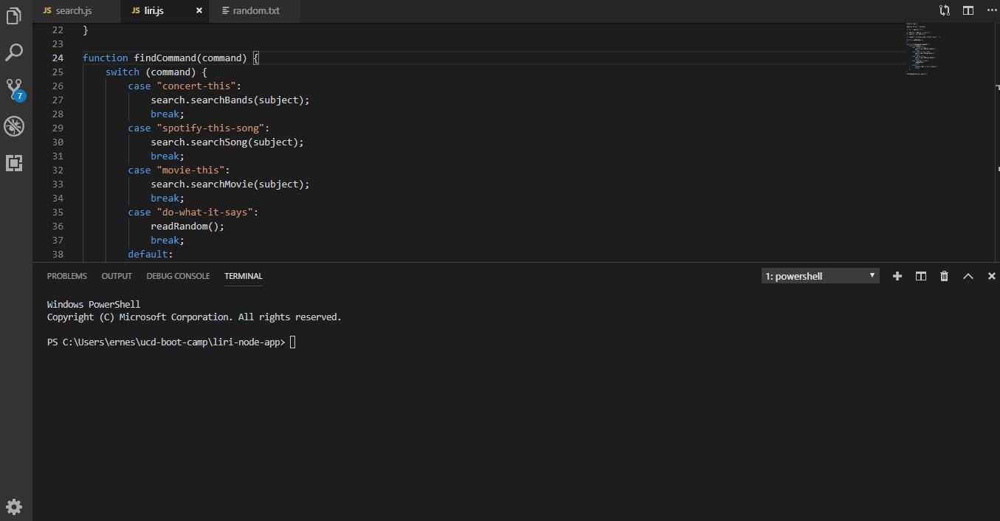

# liri-node-app

## Commands

* concert-this

    * Follow this command with the name of an artist/band
    * Data for an upcoming event will be returned

* spotify-this-song

    * Follow this command with the name of any song

* movie-this

    * The following argument should be the name of a movie

* do-what-it-says

    * The node app will look at the random.txt file and execute one of the above functions

